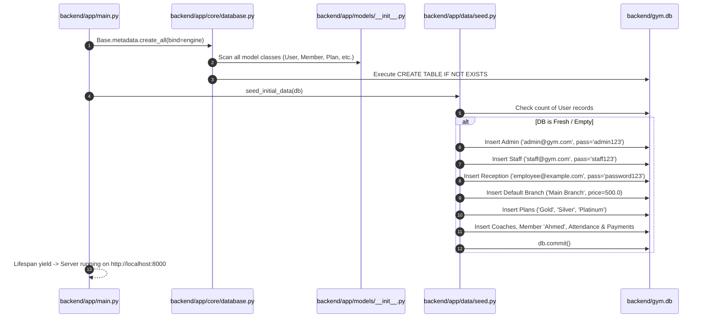
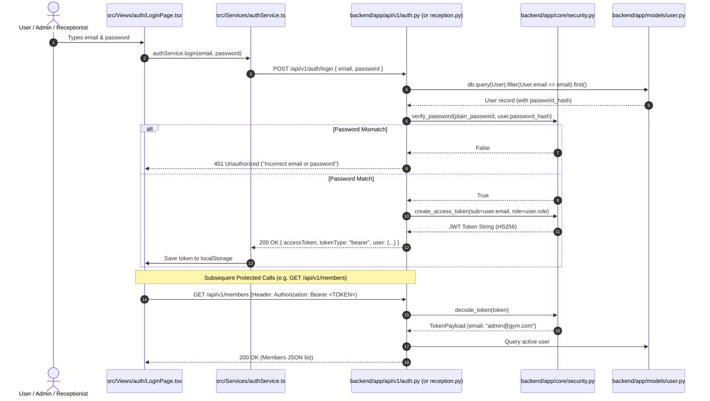
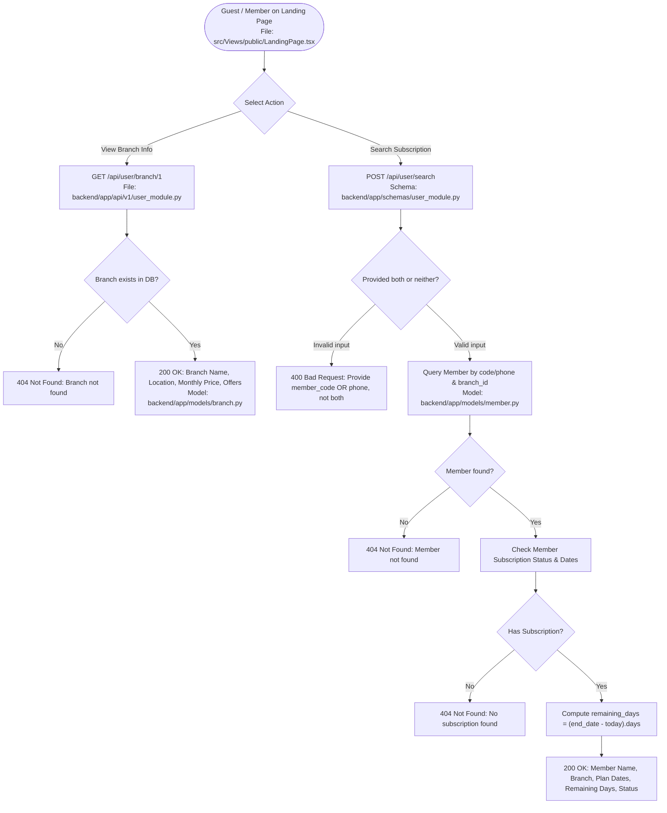
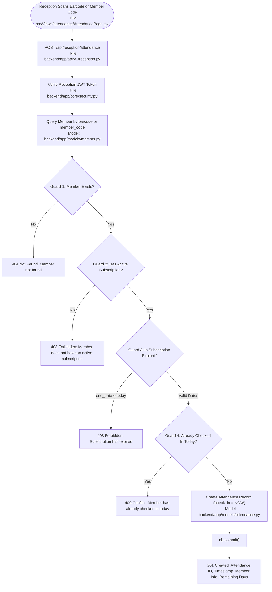
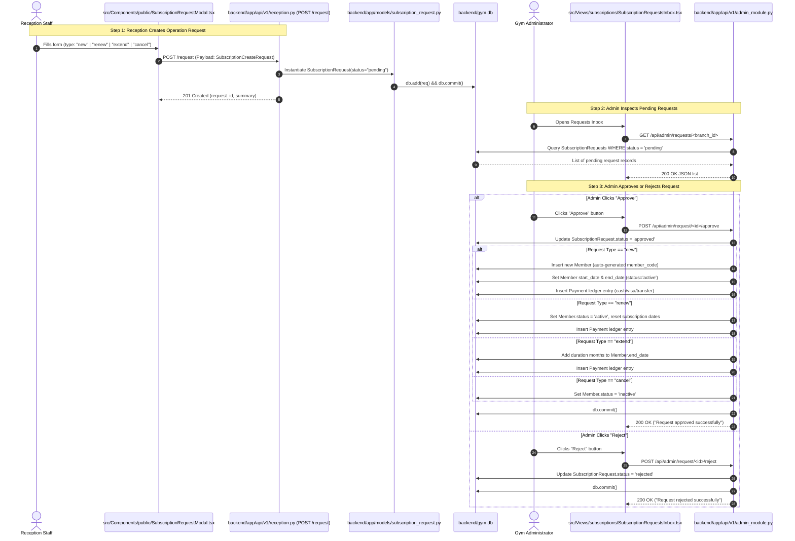
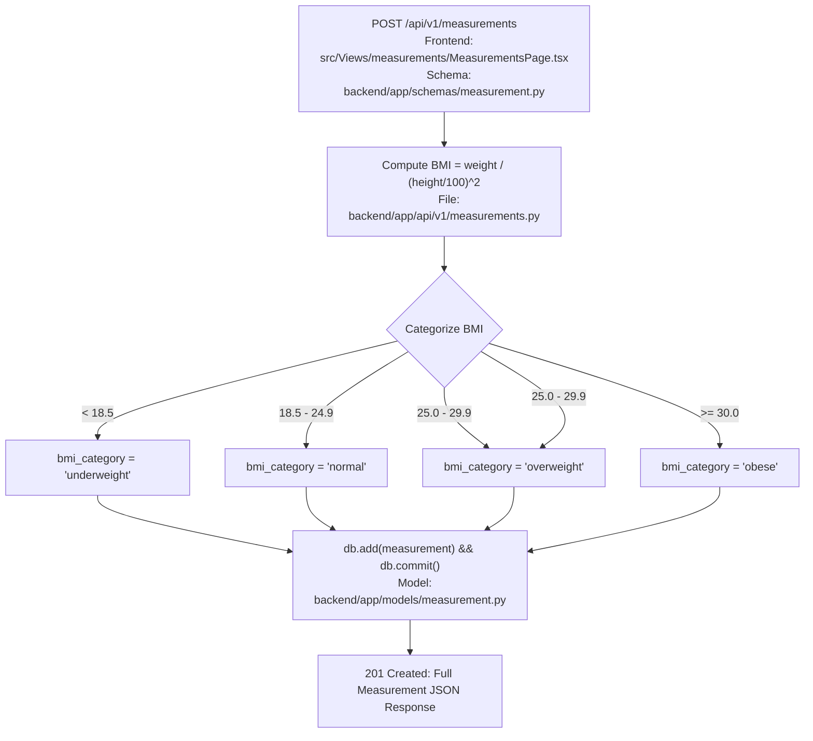
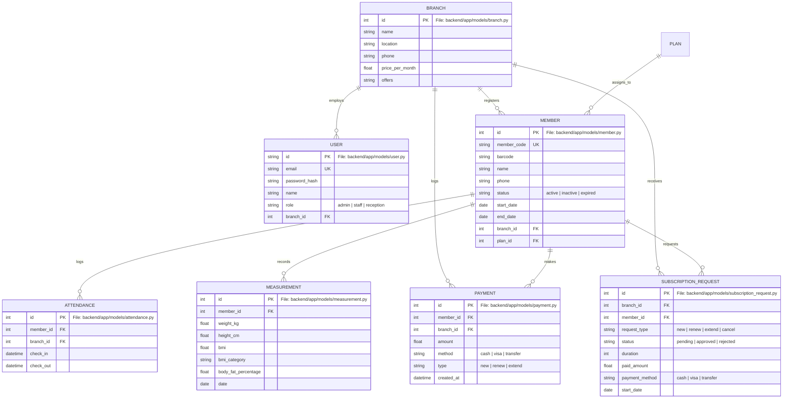

# 🚀 Backend Architecture & Flow Guide (With Source File Mapping)

A deep-dive technical guide explaining the lifecycle, data flow, security model, and business logic pipelines of the **Fitness & Gym Management FastAPI Backend**, mapped directly to the exact source files.

---

## 📑 Table of Contents

1. [High-Level Architecture & Source Files Directory](#1-high-level-architecture--source-files-directory)
2. [Server Startup & Lifespan Flow](#2-server-startup--lifespan-flow)
3. [Authentication & Authorization Flow](#3-authentication--authorization-flow)
4. [Public Storefront & Member Lookup Flow](#4-public-storefront--member-lookup-flow)
5. [Reception Desk & Attendance Pipeline](#5-reception-desk--attendance-pipeline)
6. [Subscription Request & Approval Workflow](#6-subscription-request--approval-workflow)
7. [Dashboard & Analytics Aggregation Pipeline](#7-dashboard--analytics-aggregation-pipeline)
8. [Body Measurements & BMI Calculation Flow](#8-body-measurements--bmi-calculation-flow)
9. [Database Entity Relationship & Model Files](#9-database-entity-relationship--model-files)
10. [Error Handling & Response Conventions](#10-error-handling--response-conventions)

---

## 1. High-Level Architecture & Source Files Directory

The backend is built as an asynchronous REST API using **FastAPI**, **SQLAlchemy ORM**, **Pydantic v2**, and **SQLite**.

### 🗂️ Complete Source File Registry

| Layer | File Path | Primary Responsibility |
| :--- | :--- | :--- |
| **App Entrypoint** | `backend/app/main.py` | FastAPI app instance, CORS middleware, lifespan events, root `/` and `/health` routes. |
| **Config & Settings** | `backend/app/core/config.py` | Environment variables, JWT secret, token expiration (`pydantic-settings`). |
| **Database Engine** | `backend/app/core/database.py` | SQLAlchemy SQLite engine, `SessionLocal`, `Base` model declarative root, `get_db()` dependency. |
| **Security & JWT** | `backend/app/core/security.py` | Password hashing & verification (`bcrypt`), JWT token creation/decoding (`python-jose`). |
| **Data Seeder** | `backend/app/data/seed.py` | Auto-seeds default admin, staff, reception users, branches, plans, coaches, and mock logs. |
| **API Router Aggregator** | `backend/app/api/v1/router.py` | Mounts all sub-routers under canonical and versioned routes. |
| **Auth Controller** | `backend/app/api/v1/auth.py` | Login (`POST /fitness/auth/login`), profile (`GET /fitness/auth/me`), `get_current_user` dependency. |
| **Public User Module** | `backend/app/api/v1/user_module.py` | Public branch lookup (`GET /fitness/user/branch/<id>`) and member search (`POST /fitness/user/search`). |
| **Reception Module** | `backend/app/api/v1/reception.py` | Reception login (`/fitness/reception/login`), protected search, check-in scanner, and `POST /fitness/request`. |
| **Admin Module** | `backend/app/api/v1/admin_module.py` | Pending requests list (`GET /fitness/admin/requests/<id>`), details, approval, and rejection. |
| **Dashboard Module** | `backend/app/api/v1/dashboard.py` | Real-time branch statistics & KPI calculations (`GET /fitness/admin/dashboard/<id>`). |
| **Reports Module** | `backend/app/api/v1/reports.py` | Subscriptions, income, top 10 members, and expired accounts analytical reports. |
| **Members CRUD** | `backend/app/api/v1/members.py` | Full CRUD operations, filtering, and pagination for gym members (`/fitness/members`). |
| **Plans CRUD** | `backend/app/api/v1/plans.py` | Subscription pricing tier management (`/fitness/plans`). |
| **Attendance Tracker** | `backend/app/api/v1/attendance.py` | Today's check-ins feed, check-out timestamps, and member history (`/fitness/attendance`). |
| **Measurements Tracker** | `backend/app/api/v1/measurements.py` | Body metrics logging with automated BMI computation and category assignment (`/fitness/measurements`). |
| **Trainers CRUD** | `backend/app/api/v1/trainers.py` | Coaches and personal trainers management (`/fitness/trainers`). |

```mermaid
flowchart TD
    Client["Frontend (React / Vite)
    Files: src/Views/*, src/Services/*"]
    
    subgraph FastAPI_Backend ["FastAPI Application (backend/app/main.py)"]
        CORS["CORS Middleware
        File: backend/app/main.py"]
        Router["Router Aggregator
        File: backend/app/api/v1/router.py"]
        
        subgraph Security_Layer ["Security & Validation"]
            JWT["OAuth2 / JWT Bearer Validation
            File: backend/app/core/security.py"]
            Pydantic["Pydantic Schemas
            Files: backend/app/schemas/*"]
            RoleCheck["Role-Based Access Control
            File: backend/app/api/v1/auth.py"]
        end
        
        subgraph Business_Modules ["Controllers (backend/app/api/v1/)"]
            AuthMod["auth.py (/api/v1/auth)"]
            UserMod["user_module.py (/api/user)"]
            RecepMod["reception.py (/api/reception, /request)"]
            AdminMod["admin_module.py (/api/admin/requests)"]
            DashMod["dashboard.py (/api/admin/dashboard)"]
            ReportMod["reports.py (/api/admin/report)"]
            CrudMod["members.py, plans.py, attendance.py, measurements.py, trainers.py"]
        end
        
        subgraph Data_Layer ["Data Access Layer"]
            Session["SQLAlchemy DB Session
            File: backend/app/core/database.py"]
            Models["SQLAlchemy ORM Models
            Files: backend/app/models/*"]
        end
    end
    
    DB[("SQLite Database
    File: backend/gym.db")]
    
    Client -->|HTTP Request| CORS
    CORS --> Router
    Router --> Security_Layer
    Security_Layer --> Business_Modules
    Business_Modules --> Session
    Session --> Models
    Models -->|SQL Queries| DB
```

---

## 2. Server Startup & Lifespan Flow

When the server starts up via `uvicorn app.main:app`, the `@asynccontextmanager lifespan` executes in `backend/app/main.py`:

---

## 3. Authentication & Authorization Flow

Handled by `backend/app/api/v1/auth.py` and `backend/app/core/security.py`.

- **Backend Route Handlers:** `backend/app/api/v1/auth.py`
- **Pydantic Validation:** `backend/app/schemas/auth.py`
- **Security Utilities:** `backend/app/core/security.py`
- **Database Model:** `backend/app/models/user.py`
- **Frontend Consumer:** `src/Views/auth/LoginPage.tsx` & `src/Services/authService.ts`

---

## 4. Public Storefront & Member Lookup Flow

Handled by `backend/app/api/v1/user_module.py` for guest visitors on the landing page.

- **Backend Route Handlers:** `backend/app/api/v1/user_module.py`
- **Pydantic Validation:** `backend/app/schemas/user_module.py`
- **Database Models:** `backend/app/models/branch.py`, `backend/app/models/member.py`
- **Frontend Consumer:** `src/Views/public/LandingPage.tsx`

---

## 5. Reception Desk & Attendance Pipeline

Handled by `backend/app/api/v1/reception.py` with multi-tier validation guards.

- **Backend Route Handlers:** `backend/app/api/v1/reception.py`
- **Pydantic Validation:** `backend/app/schemas/reception.py`
- **Database Models:** `backend/app/models/member.py`, `backend/app/models/attendance.py`
- **Frontend Consumer:** `src/Views/attendance/AttendancePage.tsx` & `src/Views/attendance/AttendanceLog.tsx`

---

## 6. Subscription Request & Approval Workflow

Handled across `backend/app/api/v1/reception.py` (Request Creation) and `backend/app/api/v1/admin_module.py` (Approval Workflow).

- **Reception Request Creation:** `backend/app/api/v1/reception.py` (`POST /request`)
- **Admin Inbox & Decisions:** `backend/app/api/v1/admin_module.py` (`GET /api/admin/requests/<id>`, `POST /approve`, `POST /reject`)
- **Pydantic Validation:** `backend/app/schemas/reception.py` & `backend/app/schemas/admin_module.py`
- **Database Models:** `backend/app/models/subscription_request.py`, `backend/app/models/member.py`, `backend/app/models/payment.py`
- **Frontend Consumers:** `src/Components/public/SubscriptionRequestModal.tsx` & `src/Views/subscriptions/SubscriptionRequestsInbox.tsx`

---

## 7. Dashboard & Analytics Aggregation Pipeline

Handled by `backend/app/api/v1/dashboard.py` and `backend/app/api/v1/reports.py`.

```mermaid
flowchart LR
    Req["GET /api/admin/dashboard/<branch_id>
    File: backend/app/api/v1/dashboard.py"] --> Handler["Dashboard Controller"]
    
    subgraph Database_Aggregations ["SQLAlchemy Aggregation Queries (backend/app/models/*)"]
        T1["COUNT(members)
        Model: member.py"]
        T2["COUNT(members) WHERE status = 'active'
        Model: member.py"]
        T3["COUNT(requests) WHERE status = 'pending'
        Model: subscription_request.py"]
        T4["COUNT(attendance) WHERE DATE(check_in) = TODAY
        Model: attendance.py"]
        T5["SUM(payments) GROUP BY payment_method WHERE DATE = TODAY
        Model: payment.py"]
        T6["COUNT(requests) GROUP BY type WHERE status = 'approved' AND DATE = TODAY
        Model: subscription_request.py"]
    end
    
    Handler --> Database_Aggregations
    Database_Aggregations --> JsonBuilder["Pydantic Response Schema
    File: backend/app/schemas/dashboard.py"]
    JsonBuilder --> Ret["200 OK Dashboard JSON Output
    Frontend: src/Views/dashboard/DashboardPage.tsx"]
```

- **Dashboard Controller:** `backend/app/api/v1/dashboard.py`
- **Reports Controller:** `backend/app/api/v1/reports.py`
- **Pydantic Schemas:** `backend/app/schemas/dashboard.py` & `backend/app/schemas/reports.py`
- **Database Models:** `backend/app/models/member.py`, `backend/app/models/attendance.py`, `backend/app/models/payment.py`, `backend/app/models/subscription_request.py`
- **Frontend Consumers:** `src/Views/dashboard/DashboardPage.tsx` & `src/Views/payments/PaymentsPage.tsx`

---

## 8. Body Measurements & BMI Calculation Flow

Handled by `backend/app/api/v1/measurements.py`.

$$\text{BMI} = \frac{\text{weight (kg)}}{\left(\frac{\text{height (cm)}}{100}\right)^2}$$

- **Backend Route Handlers:** `backend/app/api/v1/measurements.py`
- **Pydantic Validation:** `backend/app/schemas/measurement.py`
- **Database Model:** `backend/app/models/measurement.py`
- **Frontend Consumer:** `src/Views/measurements/MeasurementsPage.tsx`

---

## 9. Database Entity Relationship & Model Files

All ORM entities are defined in `backend/app/models/` and registered in `backend/app/models/__init__.py`:

### 📂 Model Files Checklist

1. `backend/app/models/branch.py` ➔ Branch entity
2. `backend/app/models/user.py` ➔ System users & staff logins
3. `backend/app/models/member.py` ➔ Gym members & active subscription state
4. `backend/app/models/plan.py` ➔ Gym subscription tiers & pricing
5. `backend/app/models/subscription_request.py` ➔ Reception-submitted pending requests
6. `backend/app/models/attendance.py` ➔ Daily check-in & check-out logs
7. `backend/app/models/payment.py` ➔ Income & payment ledger transactions
8. `backend/app/models/measurement.py` ➔ Body metrics & BMI records
9. `backend/app/models/trainer.py` ➔ Fitness coaches & trainers directory

---

## 10. Error Handling & Response Conventions

All API controllers use standard FastAPI `HTTPException` triggers:

| Status Code | Meaning | Code Trigger File | Scenario |
| :--- | :--- | :--- | :--- |
| **`200 OK`** | Request succeeded | `backend/app/api/v1/*.py` | Successful data fetch, search, or status update |
| **`201 Created`** | Resource created | `reception.py`, `measurements.py` | Successful check-in, request creation, measurement log |
| **`400 Bad Request`** | Validation error | `user_module.py`, `reception.py` | Conflicting search parameters (providing both code and phone) |
| **`401 Unauthorized`** | Authentication failed | `auth.py`, `security.py` | Invalid password or malformed/expired JWT token |
| **`403 Forbidden`** | Guard permission denied | `reception.py` | Member checking in with expired or inactive subscription |
| **`404 Not Found`** | Record missing | `members.py`, `plans.py`, `branch.py` | Target ID does not exist in SQLite database |
| **`409 Conflict`** | Duplicate operation | `reception.py` | Member attempting to check in twice on the same day |
| **`500 Internal Error`** | Uncaught server error | `backend/app/main.py` | Unexpected database or internal system exception |
