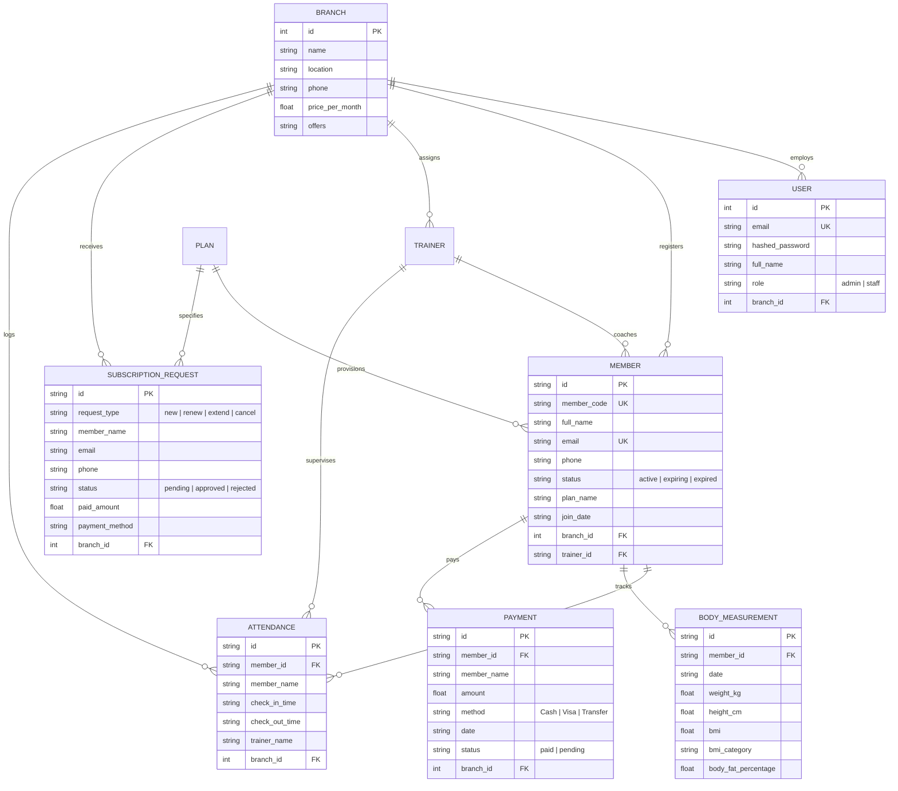

# 🏋️ GEM — Gym Management & Membership System (Backend API)

<div align="center">


**A high-performance, asynchronous REST API engine for gym operations, multi-branch management, attendance scanning, biometric BMI analytics, financial reporting, and online membership provisioning.**

[](https://fastapi.tiangolo.com/)
[](https://www.python.org/)
[](https://www.sqlalchemy.org/)
[](https://docs.pydantic.dev/)
[](https://www.sqlite.org/)
[](https://jwt.io/)
[](https://vercel.com/)

[Overview](#-about-the-backend) • [System Architecture](#-system-architecture) • [Key Capabilities](#-backend-capabilities) • [API Directory](#-api-endpoints-directory) • [Running Locally](#-getting-started--running-locally) • [Database Models](#-database-models--schema) • [Deployment](#-deployment-on-vercel)

</div>

---

### 📚 Complete System Documentation Guides:
- 🚀 **[Backend Architecture & Flow Guide (BACKEND_FLOW.md)](./BACKEND_FLOW.md)** — In-depth component lifecycles, database schemas, and sequence diagrams.
- 📖 **[Backend API Reference Manual (API_DOCUMENTATION.md)](./API_DOCUMENTATION.md)** — Complete OpenAPI specification with request/response schemas.
- 🎨 **[Frontend Architecture & Flow Guide (FRONTEND_FLOW.md)](../FRONTEND_FLOW.md)** — React 18 component tree and client hooks.
- 🏋️ **[Frontend Main Documentation (README.md)](../README.md)** — Application overview and client setup.

---

## 🌟 About The Backend

The **GEM Backend API** is a modern, production-ready Python service built with **FastAPI**, **SQLAlchemy ORM**, **Pydantic v2**, and **SQLite**. It handles the core business logic, database transactions, authorization rules, and analytical computations for the entire GEM platform.

The service provides:
1. **Multi-Branch Isolation & Aggregation**: Manages data for Branch 1 (*Main Branch Khanqah*) and Branch 2 (*Downtown Branch City Center*).
2. **Robust Security Layer**: Password hashing with `bcrypt`, token creation with `python-jose`, and role guards (`Admin` vs. `Staff`).
3. **Automated Lifespan Seeding**: Auto-initializes SQLite database tables and seeds realistic demo data on startup.
4. **Dual Execution Modes**: Runs locally via `uvicorn` ASGI server or serverless in production on **Vercel** (`api/index.py`).

---

## 🏗️ System Architecture

```
┌────────────────────────────────────────────────────────────────────────┐
│                        FastAPI Application Gateway                     │
│               • CORS Middleware  • Lifespan Seeder Engine              │
└───────────────────────────────────┬────────────────────────────────────┘
                                    │
                                    ▼
┌────────────────────────────────────────────────────────────────────────┐
│                        Security & Validation Layer                     │
│      • OAuth2 JWT Bearer Token Guard  • Pydantic v2 DTO Schemas       │
│      • Role-Based Access Control: Admin (Full) vs Staff (Front Desk)   │
└───────────────────────────────────┬────────────────────────────────────┘
                                    │
                                    ▼
┌────────────────────────────────────────────────────────────────────────┐
│                    Modular Controllers & API Routers                   │
│  ┌───────────────────────┬───────────────────────┬──────────────────┐  │
│  │ 🔐 auth.py            │ 👥 members.py         │ 📋 plans.py      │  │
│  │ • POST /fitness/auth  │ • CRUD Member Records │ • Plan Tiers     │  │
│  ├───────────────────────┼───────────────────────┼──────────────────┤  │
│  │ ⏱️ attendance.py      │ ⚖️ measurements.py    │ 🏃 trainers.py   │  │
│  │ • Check-In / Out Log  │ • BMI Auto-Classifier │ • Coach Rosters  │  │
│  ├───────────────────────┼───────────────────────┼──────────────────┤  │
│  │ 📊 dashboard.py       │ 📈 reports.py         │ 💳 payments.py   │  │
│  │ • KPI Branch Stats    │ • Income & Operations │ • Invoicing Log  │  │
│  ├───────────────────────┴───────────────────────┴──────────────────┤  │
│  │ 📬 admin_module.py & reception.py: Online Requests & 1-Click Appr│  │
│  └──────────────────────────────────────────────────────────────────┘  │
└───────────────────────────────────┬────────────────────────────────────┘
                                    │
                                    ▼
┌────────────────────────────────────────────────────────────────────────┐
│                   SQLAlchemy 2.0 ORM & Database Layer                  │
│               • SQLite Database Engine (backend/gym.db)                │
│     • Users • Branches • Members • Subscriptions • Requests • Logs     │
└────────────────────────────────────────────────────────────────────────┘
```

---

## ⚡ Backend Capabilities

| Capability | Module & Router | Functionality & Logic |
| :--- | :--- | :--- |
| 🔐 **Authentication** | `app/api/v1/auth.py` | JWT token issuing (`POST /fitness/auth/login`), profile lookup (`GET /fitness/auth/me`), Bearer authorization. |
| 🏢 **Branch Isolation** | `app/api/v1/user_module.py` | Branch metadata, location info, monthly base prices, and promotional offers. |
| 👥 **Member Management**| `app/api/v1/members.py` | Full CRUD operations, search queries (`?search=`), status filtering (`active`, `expiring`, `expired`), and branch scoping. |
| ⏱️ **Reception Check-In**| `app/api/v1/attendance.py` | 1-Click fast check-in by Member ID or Code, trainer assignment, check-out logging, and active occupancy counts. |
| 📬 **Inquiries & Approval**| `app/api/v1/admin_module.py`| Online subscription request submission (`POST /fitness/request`), email validation (`/fitness/check-email`), and 1-Click auto-provisioning approval. |
| ⚖️ **BMI & Biometrics** | `app/api/v1/measurements.py`| Biometric measurement logs with automated BMI computation and category assignment (*Underweight, Normal, Overweight, Obese*). |
| 🏋️ **Trainer Directory** | `app/api/v1/trainers.py` | Fitness coach profiles, specialty tagging, hourly rates, and client counts. |
| 💳 **Financial Ledger** | `app/api/v1/payments.py` | Invoicing records, multi-channel payment logging (Cash, Card, Transfer), and printable receipt data. |
| 📊 **Executive Dashboard**| `app/api/v1/dashboard.py`| Real-time branch stats (Members, Active Subscriptions, Today's Check-ins, Pending Inquiries, Today's Income). |
| 📈 **Analytical Reports**| `app/api/v1/reports.py` | Revenue trends, operations breakdown (*New, Renew, Extend, Cancel*), top 10 members attendance leaderboard, and expired follow-ups. |

---

## 📁 Code Organization & Project Structure

```
backend/
├── API_DOCUMENTATION.md          # Exhaustive API reference manual with JSON schemas
├── BACKEND_FLOW.md               # Backend lifecycle, transaction sequences, and data flows
├── README.md                     # Backend architectural overview and developer guide
├── requirements.txt              # Python package dependencies
├── gym.db                        # SQLite production/development database file
│
└── app/
    ├── __init__.py               # Package root
    ├── main.py                   # FastAPI app entrypoint, lifespan seeder, CORS configuration
    │
    ├── api/                      # Routing and controller layer
    │   ├── deps.py               # Dependency injection (get_db, get_current_user, require_admin)
    │   └── v1/                   # API Version 1 endpoints (/fitness/*)
    │       ├── admin_module.py   # Admin requests inbox, details, approval, and rejection
    │       ├── attendance.py     # Check-in, check-out, today's logs, and live visitor stats
    │       ├── auth.py           # Login, JWT issuing, current user verification
    │       ├── dashboard.py      # Real-time branch dashboard metrics
    │       ├── measurements.py   # Biometric logging & automated BMI computation
    │       ├── members.py        # Member directory CRUD and filtering
    │       ├── payments.py       # Payment records and transactions
    │       ├── plans.py          # Membership pricing plans CRUD
    │       ├── reception.py      # Front-desk member search, check-in scanner, online requests
    │       ├── reports.py        # Income, operations, top members, and expired reports
    │       ├── router.py         # Master API router aggregating all sub-routers
    │       ├── trainers.py       # Trainer profiles and hourly rates
    │       └── user_module.py    # Public branch info and member search
    │
    ├── core/                     # Application foundation
    │   ├── config.py             # App settings, secrets, CORS origins (pydantic-settings)
    │   ├── database.py           # SQLAlchemy SQLite engine, SessionLocal, Base model
    │   └── security.py           # Passlib bcrypt hashing, JWT encode/decode routines
    │
    ├── data/                     # Seed datasets and bootstrap scripts
    │   └── seed.py               # Automatic initial seed data generator
    │
    ├── models/                   # SQLAlchemy ORM database models
    │   ├── attendance.py         # Attendance check-in/out records table
    │   ├── branch.py             # Gym branches table (Khanqah, City Center)
    │   ├── measurement.py        # Body composition and biometric logs table
    │   ├── member.py             # Gym members table
    │   ├── payment.py            # Financial payment transactions table
    │   ├── plan.py               # Membership subscription tiers table
    │   ├── subscription_request.py # Pending/approved online subscription requests
    │   ├── trainer.py            # Coaches and trainers table
    │   └── user.py               # Staff and admin login accounts table
    │
    └── schemas/                  # Pydantic v2 validation DTOs
        ├── admin_module.py       # Request approval/rejection DTOs
        ├── attendance.py         # Check-in input & attendance stats DTOs
        ├── auth.py               # Login credentials, token response, user profile DTOs
        ├── dashboard.py          # KPI metrics response DTOs
        ├── measurement.py        # Biometric measurements & BMI DTOs
        ├── member.py             # Member create/update DTOs
        ├── plan.py               # Plan create/update DTOs
        ├── reception.py          # Front-desk search & scanner DTOs
        ├── report.py             # Income & operations report DTOs
        ├── subscription.py       # Subscription DTOs
        ├── trainer.py            # Trainer profile DTOs
        └── user_module.py        # Public branch and search response DTOs
```

---

## 🔌 API Endpoints Directory (Prefix: `/fitness`)

### 🔐 Authentication (`/fitness/auth`)
| Method | Endpoint | Description | Access Level |
| :--- | :--- | :--- | :--- |
| `POST` | `/fitness/auth/login` | Authenticate with email & password, returns JWT Bearer token | 🌍 Public |
| `GET` | `/fitness/auth/me` | Fetch active user profile and permissions | 🔒 Staff & Admin |

### 👥 Member Operations (`/fitness/members`)
| Method | Endpoint | Description | Access Level |
| :--- | :--- | :--- | :--- |
| `GET` | `/fitness/members` | List members with search (`?search=`), status (`?status=`), branch filter | 🔒 Staff & Admin |
| `GET` | `/fitness/members/{id}` | Get single member record by ID | 🔒 Staff & Admin |
| `POST` | `/fitness/members` | Create a new member record | 🔒 Staff & Admin |
| `PUT` | `/fitness/members/{id}` | Update member profile and subscription details | 🔒 Staff & Admin |
| `DELETE` | `/fitness/members/{id}` | Delete member record | 🛡️ Admin Only |

### 📋 Membership Plans (`/fitness/plans`)
| Method | Endpoint | Description | Access Level |
| :--- | :--- | :--- | :--- |
| `GET` | `/fitness/plans` | List active membership packages | 🌍 Public |
| `GET` | `/fitness/plans/{id}` | Get single plan details | 🌍 Public |
| `POST` | `/fitness/plans` | Create a new membership plan | 🛡️ Admin Only |
| `PUT` | `/fitness/plans/{id}` | Update existing plan details | 🛡️ Admin Only |
| `DELETE` | `/fitness/plans/{id}` | Delete membership plan | 🛡️ Admin Only |

### ⏱️ Attendance & Front-Desk (`/fitness/attendance`)
| Method | Endpoint | Description | Access Level |
| :--- | :--- | :--- | :--- |
| `GET` | `/fitness/attendance/today` | List today's check-ins for a branch | 🔒 Staff & Admin |
| `GET` | `/fitness/attendance/stats` | Live facility occupancy statistics (Checked in, Active now, Monthly) | 🔒 Staff & Admin |
| `POST` | `/fitness/attendance/check-in` | Record member check-in timestamp with optional coach tag | 🔒 Staff & Admin |
| `POST` | `/fitness/attendance/check-out`| Record member check-out timestamp | 🔒 Staff & Admin |
| `GET` | `/fitness/attendance/member/{id}`| Attendance history for a specific member | 🔒 Staff & Admin |

### ⚖️ Biometric Measurements (`/fitness/measurements`)
| Method | Endpoint | Description | Access Level |
| :--- | :--- | :--- | :--- |
| `GET` | `/fitness/measurements/member/{id}` | Historical body composition measurements for a member | 🔒 Staff & Admin |
| `POST` | `/fitness/measurements` | Record new metrics (Automatically calculates BMI & category) | 🔒 Staff & Admin |
| `DELETE` | `/fitness/measurements/{id}` | Delete a measurement record | 🔒 Staff & Admin |

### 🏃 Coaches & Trainers (`/fitness/trainers`)
| Method | Endpoint | Description | Access Level |
| :--- | :--- | :--- | :--- |
| `GET` | `/fitness/trainers` | List all coaches and personal trainers | 🌍 Public |
| `GET` | `/fitness/trainers/{id}` | Get coach profile by ID | 🌍 Public |
| `POST` | `/fitness/trainers` | Add a new trainer profile | 🛡️ Admin Only |
| `PUT` | `/fitness/trainers/{id}` | Update trainer details and availability | 🛡️ Admin Only |
| `DELETE` | `/fitness/trainers/{id}` | Delete trainer profile | 🛡️ Admin Only |

### 💳 Financial Ledger (`/fitness/payments`)
| Method | Endpoint | Description | Access Level |
| :--- | :--- | :--- | :--- |
| `GET` | `/fitness/payments` | List payment transactions filtered by branch | 🛡️ Admin Only |
| `GET` | `/fitness/payments/member/{id}` | List payments for a specific member | 🛡️ Admin Only |
| `POST` | `/fitness/payments` | Record new payment transaction | 🛡️ Admin Only |

### 📬 Admin Requests & Approval (`/fitness/admin/requests`)
| Method | Endpoint | Description | Access Level |
| :--- | :--- | :--- | :--- |
| `GET` | `/fitness/admin/requests/{branch_id}` | List pending online subscription requests | 🛡️ Admin Only |
| `GET` | `/fitness/admin/request/{request_id}` | Get details of a specific request | 🛡️ Admin Only |
| `POST` | `/fitness/admin/request/{request_id}/approve` | **1-Click Approval:** Provisions active member & subscription | 🛡️ Admin Only |
| `POST` | `/fitness/admin/request/{request_id}/reject` | Reject online subscription request | 🛡️ Admin Only |

### 📊 Dashboard & Analytics (`/fitness/admin/dashboard` & `/fitness/admin/report`)
| Method | Endpoint | Description | Access Level |
| :--- | :--- | :--- | :--- |
| `GET` | `/fitness/admin/dashboard/{branch_id}` | Executive KPI stats (members, active subs, check-ins, income) | 🛡️ Admin Only |
| `GET` | `/fitness/admin/report/income/{branch_id}` | Income breakdown (Cash, Card, Transfer, Total) | 🛡️ Admin Only |
| `GET` | `/fitness/admin/report/subscriptions/{branch_id}`| Operations breakdown (New, Renew, Extend, Cancel) | 🛡️ Admin Only |
| `GET` | `/fitness/admin/report/top-members/{branch_id}` | Top 10 most active members by attendance count | 🛡️ Admin Only |
| `GET` | `/fitness/admin/report/expired-subscriptions/{branch_id}` | Expired memberships requiring follow-up | 🛡️ Admin Only |

### 👤 Public User & Onboarding (`/fitness/user`, `/fitness/branches`, `/fitness/check-email`)
| Method | Endpoint | Description | Access Level |
| :--- | :--- | :--- | :--- |
| `GET` | `/fitness/branches` | List all available gym branches | 🌍 Public |
| `GET` | `/fitness/user/branch/{branch_id}` | Get branch information, price per month, and offers | 🌍 Public |
| `POST` | `/fitness/user/search` | Search member status by Member Code or Phone number | 🌍 Public |
| `GET` | `/fitness/check-email` | Validate if email is already registered or has pending request | 🌍 Public |
| `POST` | `/fitness/request` | Submit online subscription inquiry questionnaire | 🌍 Public |

---

## 🚀 Getting Started & Running Locally

### Prerequisites
- **Python 3.10+**
- Virtual environment tool (`venv`)

### 1. Setup Virtual Environment & Dependencies
```powershell
# Navigate to backend directory
cd backend

# Create virtual environment
python -m venv .venv

# Activate virtual environment (Windows PowerShell)
.\.venv\Scripts\Activate.ps1

# Install requirements
pip install -r requirements.txt
```

### 2. Start the Backend API Server
```powershell
# Using Uvicorn directly
uvicorn app.main:app --reload --host 0.0.0.0 --port 8000

# Or from project root via npm script
npm run backend
```

The API will be live at `http://localhost:8000`.

### 3. Interactive Documentation
- **Swagger UI (Interactive API Testing):** [http://localhost:8000/docs](http://localhost:8000/docs)
- **ReDoc Documentation:** [http://localhost:8000/redoc](http://localhost:8000/redoc)
- **Health Check:** [http://localhost:8000/health](http://localhost:8000/health)

---

## 🔑 Default Seed Accounts

The backend automatically seeds `backend/gym.db` with these credentials upon first launch:

| Account Type | Email | Password | Role & Permissions |
| :--- | :--- | :--- | :--- |
| **Administrator** | `admin@gym.com` | `admin123` | Full access to all endpoints, reports, approval flows, and financials |
| **Staff Member** | `staff@gym.com` | `staff123` | Front-desk reception, attendance check-in, measurements, trainer views |

---

## 🗄️ Database Models & Schema

The SQLite database (`backend/gym.db`) uses **SQLAlchemy 2.0** ORM models:



---

## ⚡ Deployment on Vercel

The backend is configured for unified serverless deployment alongside the React frontend via [`vercel.json`](../vercel.json) and [`api/index.py`](../api/index.py):

```json
{
  "outputDirectory": "dist",
  "rewrites": [
    { "source": "/fitness/(.*)", "destination": "/api/index.py" },
    { "source": "/health",       "destination": "/api/index.py" },
    { "source": "/docs",         "destination": "/api/index.py" },
    { "source": "/openapi.json", "destination": "/api/index.py" },
    { "source": "/redoc",        "destination": "/api/index.py" },
    { "source": "/(.*)",         "destination": "/index.html"   }
  ]
}
```

* **Serverless Entrypoint**: [`api/index.py`](../api/index.py) dynamically resolves the project root and imports `app.main:app`.
* **Zero CORS Overhead**: Because the frontend and backend share the same domain on Vercel, requests to `/fitness/*` are routed directly to the Python runtime.

---

## 📄 License & Maintainers
Engineered for the **GEM Gym Management System**. All rights reserved.
